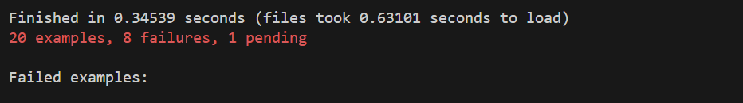

# README

The challenge is make sure when you run `bundle exec rspec`, all result is green (without error):) 

Test Results:

Notes:
I wasn't able to procure all the test to all green sadly :(. As for the endpoints I think I've managed to create them all just wasn't enough to satisfy the tests. The rest of the uncomplete problems are tests, Json parser results, and Factory objects. I have to consult my friend for Ruby and Rails specifically and have him teach me most of the syntax and conventions (huge thanks to Reyhan!). And also huge thanks to Rakamin Academy for this, kickstarting myself to learn ruby on rails! I may finish this challenge in the future. 
